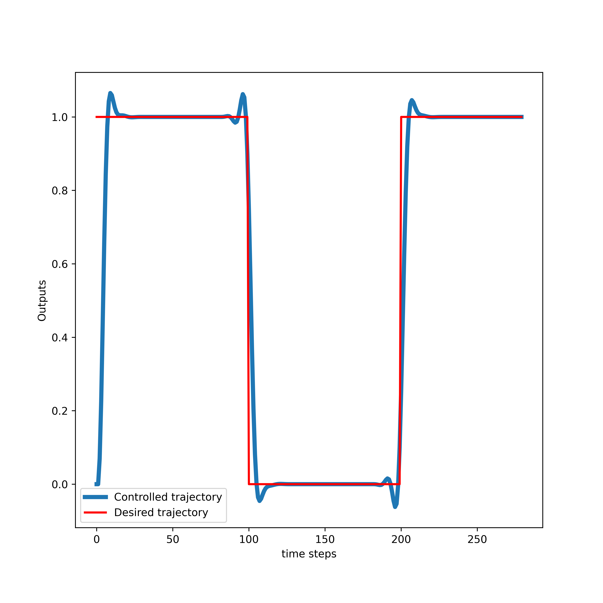

# Model-Predictive-Control-Implementation-in-Python-1
Here, we post the codes that implement the Model Predictive Controller (MPC) for linear systems. 

In this repository, we post the Python codes that implement the MPC algorithm for linear systems. In the tutorial page given below we explain how to develop the MPC algorithm from scratch:

https://aleksandarhaber.com/model-predictive-control-mpc-tutorial-1-unconstrained-formulation-derivation-and-implementation-in-python-from-scratch/

Explanation of posted code files:

- "driverCodeMPC.py" is the driver code for the MPC algorithm
- "ModelPredictiveControl.py" is the code file that implements the MPC algorithm in Python
- "functionMPC.py"  is the code file that implements the function for calculating the response of the system

The performance of the MPC algorithm for tracking a pulse trajectory is given below. 
  

LICENSE: THIS CODE CAN BE USED FREE OF CHARGE ONLY FOR ACADEMIC AND EDUCATIONAL PURPOSES. THAT IS, IT CAN BE USED FREE OF CHARGE ONLY IF THE PURPOSE IS NON-COMMERCIAL AND IF THE PURPOSE IS NOT TO MAKE PROFIT OR EARN MONEY BY USING THIS CODE.

IF YOU WANT TO USE THIS CODE IN THE COMMERCIAL SETTING, THAT IS, IF YOU WORK FOR A COMPANY OR IF YOU ARE AN INDEPENDENT
CONSULTANT AND IF YOU WANT TO USE THIS CODE, THEN WITHOUT MY PERMISSION AND WITHOUT PAYING THE PROPER FEE, YOU ARE NOT ALLOWED TO USE THIS CODE. YOU CAN CONTACT ME AT

aleksandar.haber@gmail.com

TO INFORM YOURSELF ABOUT THE LICENSE OPTIONS AND FEES FOR USING THIS CODE.
ALSO, IT IS NOT ALLOWED TO 
(1) MODIFY THIS CODE IN ANY WAY WITHOUT MY PERMISSION.
(2) INTEGRATE THIS CODE IN OTHER PROJECTS WITHOUT MY PERMISSION.

 DELIBERATE OR INDELIBERATE VIOLATIONS OF THIS LICENSE WILL INDUCE LEGAL ACTIONS AND LAWSUITS. 
